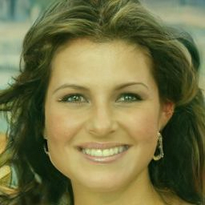
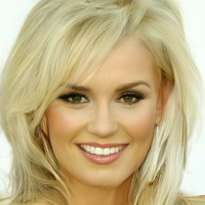
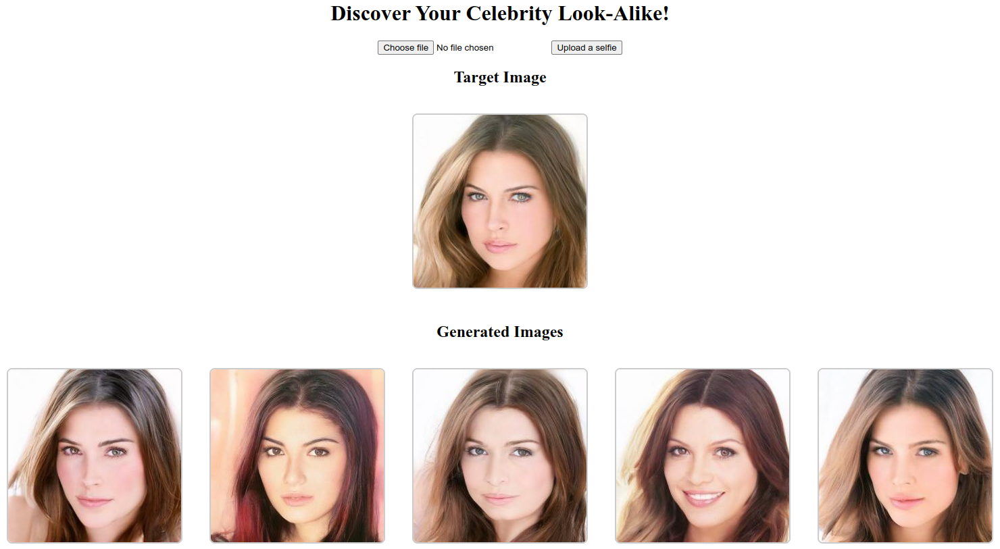
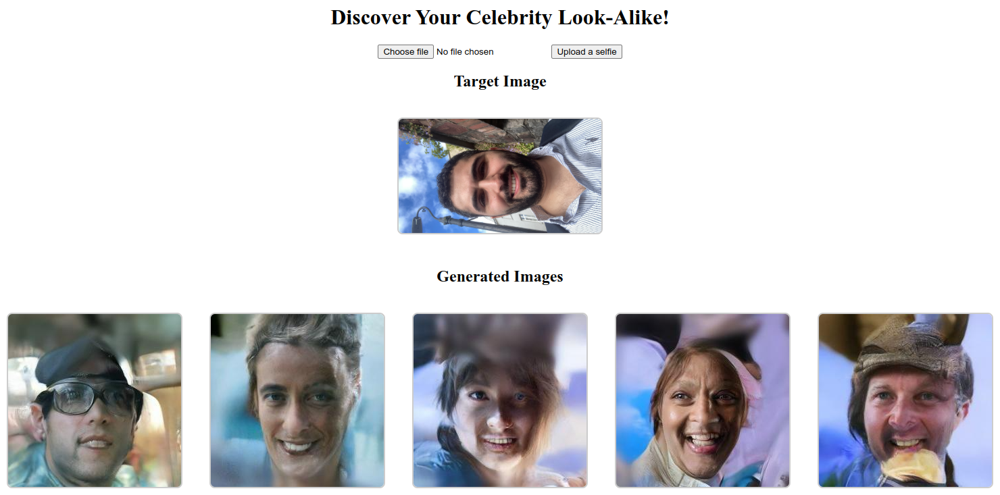
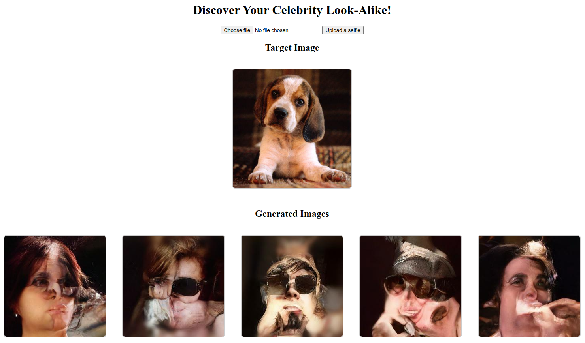
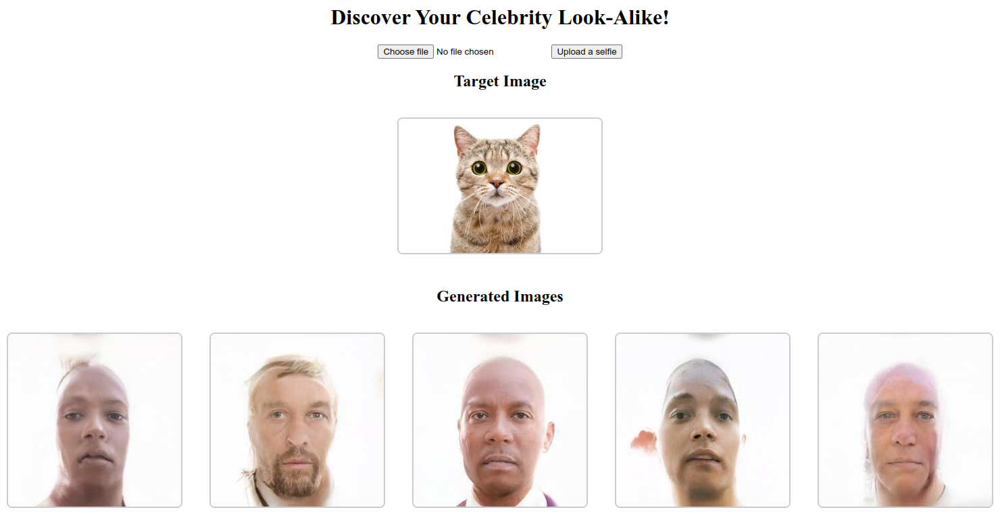

This repository implements a Flask app for a [Denoising Diffusion Probabilistic Model (DDPM)](https://arxiv.org/pdf/2006.11239) on Google Cloud using a containerized Flask application. 
Given a user-uploaded selfie, the model generates celebrity faces that resemble the input image. The model is served through a backend and can be accessed via a web frontend hosted on GCP Cloud Run.
The model is based on Hugging Face's [`diffusers`](https://github.com/huggingface/diffusers) library, and is trained on 30,000 high-quality celebrity faces resized to 256×256 pixels.

## DDPM with Guidance
Diffusion models (DMs) are a class of generative models that progressively transform random noise into data samples (such as images). The goal of diffusion models is to generate samples from a complex distribution by simulating a Markov chain of noisy steps—starting from Gaussian noise and gradually moving toward the target distribution (e.g., real images). The model is trained to predict the noise added at each step, which can be interpreted as learning the gradient of the data distribution.
One limitation of the vanilla DDPM is its lack of control over the generated images. To address this, guidance can be introduced to steer the model toward a desired output.
In this implementation, we incorporate a guidance method by introducing a loss function that measures the difference between the generated image and a target image. This image loss guides the diffusion process, nudging the model toward producing images that resemble the specified target.

## Local Development & Testing

You can run the app locally using Docker or a Python virtual environment.

### Using Docker

#### Build the image:
```bash
cd /path/to/project-root
docker build -t flask-app .
```
Run the container (GPU-enabled):
```bash
docker run --gpus all -p 5000:8080 -v $(pwd):/app -e PORT=8080 flask-app
```
> **Note**: Ensure that your system has NVIDIA drivers and the NVIDIA Container Toolkit installed to enable GPU support.

### Using Python Virtual Environment
```bash
python -m venv venv
source venv/bin/activate  # or `venv\Scripts\activate` on Windows
pip install -r requirements.txt 
```
Run the Flask app:
```bash
python main.py
```
## GCP Deployment
You’ll need:

- A Google Cloud account
- The gcloud CLI installed and authenticated

Setup
Set your GCP region:
```bash
gcloud config set run/region europe-west1
```
Create a Docker Artifact Repository:
```bash
gcloud run deploy guided-ddpm-service \
  --image=europe-west4-docker.pkg.dev/guided-ddpm/docker-repo/guided-ddpm:v0 \
  --region=europe-west1 \
  --cpu=4 \
  --memory=16Gi \
  --port=8080
```
Build and push your image:

```bash
gcloud builds submit --tag europe-west4-docker.pkg.dev/guided-ddpm/docker-repo/guided-ddpm:v0
```
Deploy to Cloud Run:
```bash
gcloud run deploy guided-ddpm-service \
  --image=europe-west4-docker.pkg.dev/guided-ddpm/docker-repo/guided-ddpm:v0 \
  --region=europe-west1 \
  --cpu=4 \
  --memory=16Gi \
  --port=8080
```
## Model Testing & Examples

Below are example generated images without guidance:






Here are some example outputs generated by the model :

### In-Distribution Data
The model performs well on in-distribution data, producing high-quality results:  


### Human Selfie
Using a selfie as input, the model generates celebrity-like faces resembling the target:  


### Non-Human Inputs
The model also attempts to generate outputs for non-human inputs:

**Dog Image**:  


**Cat Image**:  

